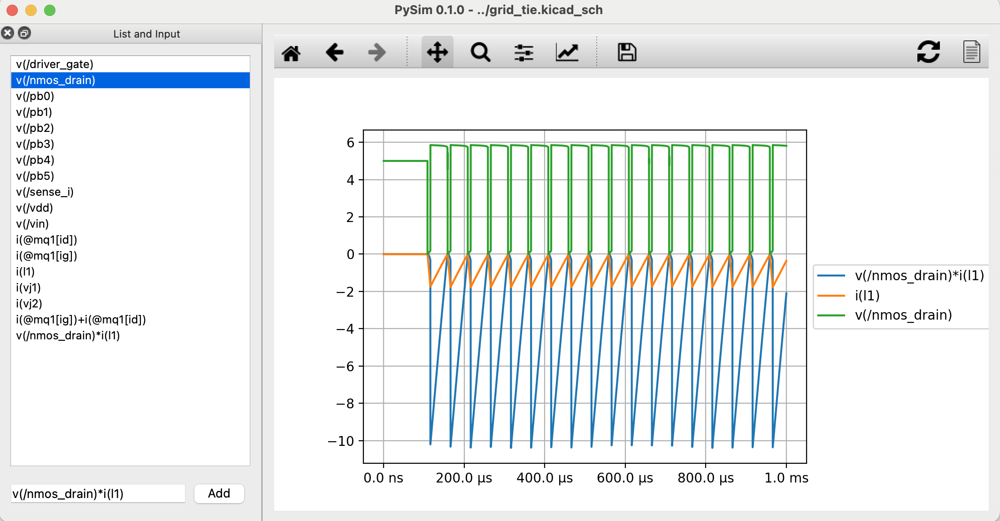

# PySim
PySim is an open source waveform viewer.
It is meant to play together with ngspice and kicad. With just one click you can netlist, simulate and show the simulation results in a window:


Make sure to include something like the following in your ngspice control section:
``` spice
.probe alli
.control
	save all
    tran 100n 1m uic
    run
    write
.endc
```
When running ngspice it should create a `rawspice.raw` file

# Features

- Netlist, simulate and show results with just one click
- Equation support

# Alpha Status

- Only tested with Mac
- Only transient simulations working currently
- All signals in one plot

It is a very simple script (currently just one file). However, I find it already quite useful.

# Ideas

- Show SOA violations
- Support for AC simulations
- ...

# Contribute

Feel free to contribute.

# Credits

I took some icons from here:

- <a href="https://www.flaticon.com/free-icons/honey" title="honey icons">Honey icons created by imaginationlol - Flaticon</a>

- <a href="https://www.flaticon.com/free-icons/document" title="document icons">Document icons created by bqlqn - Flaticon</a>

- <a href="https://www.flaticon.com/free-icons/refresh" title="refresh icons">Refresh icons created by Dave Gandy - Flaticon</a>
